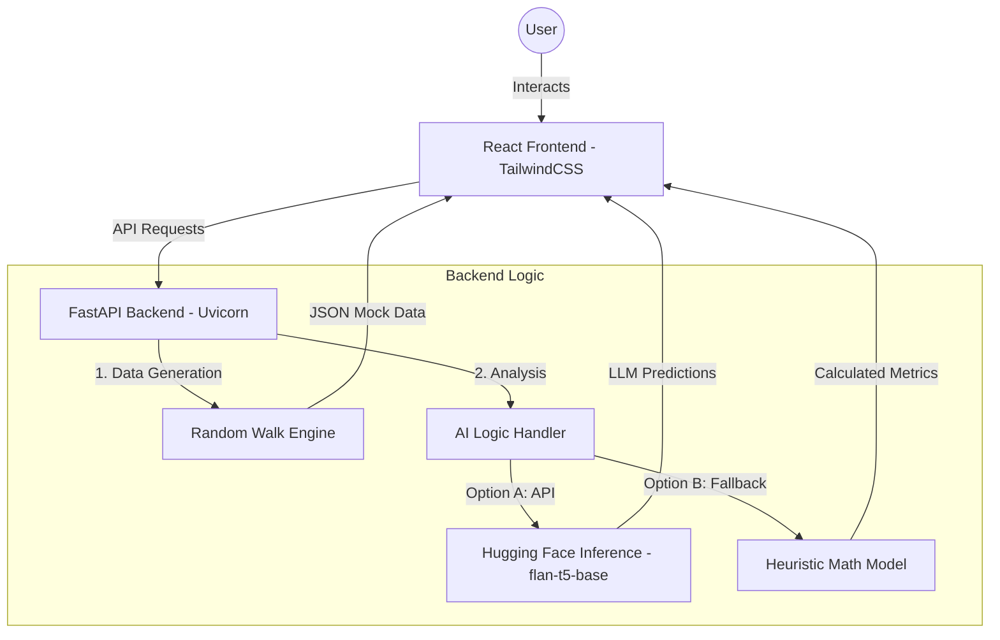

# 📈 RealTicker — AI-Powered Stock Analysis Platform

RealTicker is a full-stack web application featuring an intelligent FastAPI backend and a gorgeous, glassmorphic React/Tailwind frontend. It serves daily mock stock history, generates interactive price trend charts, and runs algorithmic AI analysis by querying Hugging Face models using dynamic heuristic fallbacks.

---

## 🚀 Features

- **Dynamic Interactive UI:** A premium dark-mode, glassmorphic web interface built in React and Tailwind CSS.
- **Stock Tracking:** Views for the Market Top 10 Stocks and detailed individual stock timelines + dynamic Recharts graphs.
- **AI Stock Analysis:** Uses Hugging Face API to analyze a stock's historical price fluctuations (Trend, Risk, and investment Suggestion). If the AI model service is unavailable, it gracefully defaults to a custom-built heuristic fallback math engine to guarantee 100% uptime.
- **Robust API:** Fast and scalable Python backend utilizing FastAPI.

---

## 🏗️ Architecture Diagram



---

## 🤖 LLM Details
This project utilizes the **google/flan-t5-base** model via the Hugging Face Inference API. 
The model is specifically prompt-engineered to perform **Zero-Shot Sentiment and Trend Analysis** on tabular stock price summaries.

- **Primary Model:** `google/flan-t5-base`
- **Fallback Logic:** Custom local mathematical heuristics (active when API limits are reached or service is offline).

---

## 🛠️ Project Structure

```text
Realticker/
├── backend/                # The FastAPI backend project
│   ├── main.py             # App logic and heuristics
│   ├── requirements.txt    # Python dependencies
│   └── .env                # API secrets
├── frontend/               # The React + Vite front-end project
│   ├── package.json        # Node.js dependencies
│   ├── tailwind.config.js  # UI theme
│   └── src/                # React source code
├── .gitignore              # Global ignore rules
└── README.md               # Main documentation
```

---

## 💻 Quick Start Guide 

To get RealTicker running on your local machine, follow these steps:

### Step 1: Start the Backend Server
1. Open your terminal and move into the backend directory:
   ```bash
   cd backend
   ```
2. Install the backend requirements:
   ```bash
   pip install -r requirements.txt
   ```
3. Initialize your `.env` file inside the `backend/` folder:
   ```text
   HF_API_TOKEN=your_token_here
   ```
4. Start the server:
   ```bash
   uvicorn main:app --reload --port 8000
   ```

### Step 2: Start the Frontend UI
1. Open a **second terminal window** and enter the frontend directory:
   ```bash
   cd frontend
   ```
2. Install dependencies and start:
   ```bash
   npm install
   npm run dev
   ```
3. 🎉 **Launch:** Visit [http://localhost:5173](http://localhost:5173) in your browser.
   *The interactive API docs are available at [http://localhost:8000/docs](http://localhost:8000/docs).*

---

## 📡 API Endpoints Summary

If you wish to test the backend API completely decoupled from the UI, you can use these endpoints directly at `http://localhost:8000`:

| Endpoint | Method | Description |
|---|---|---|
| `/api/stocks/top10` | `GET` | Returns 10 mock stocks with ticker, company, price, change %, and volume |
| `/api/stocks/{ticker}/history` | `GET` | Returns 180 days of mock daily price data for a given ticker |
| `/api/stocks/{ticker}/analyze` | `POST` | Accepts a price array `{"prices": [...]}` and returns algorithmic trend/risk logic |

---

## ⚖️ Disclaimer
*The AI analysis generated by RealTicker is purely for educational demonstration purposes and does absolutely not constitute genuine financial advice.*
